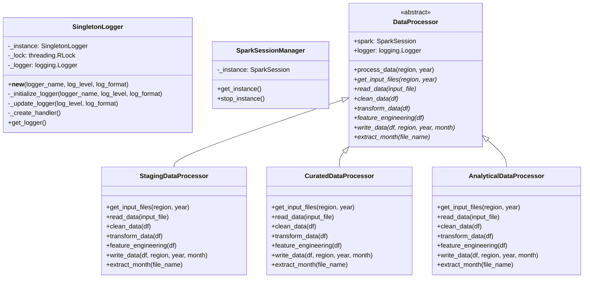
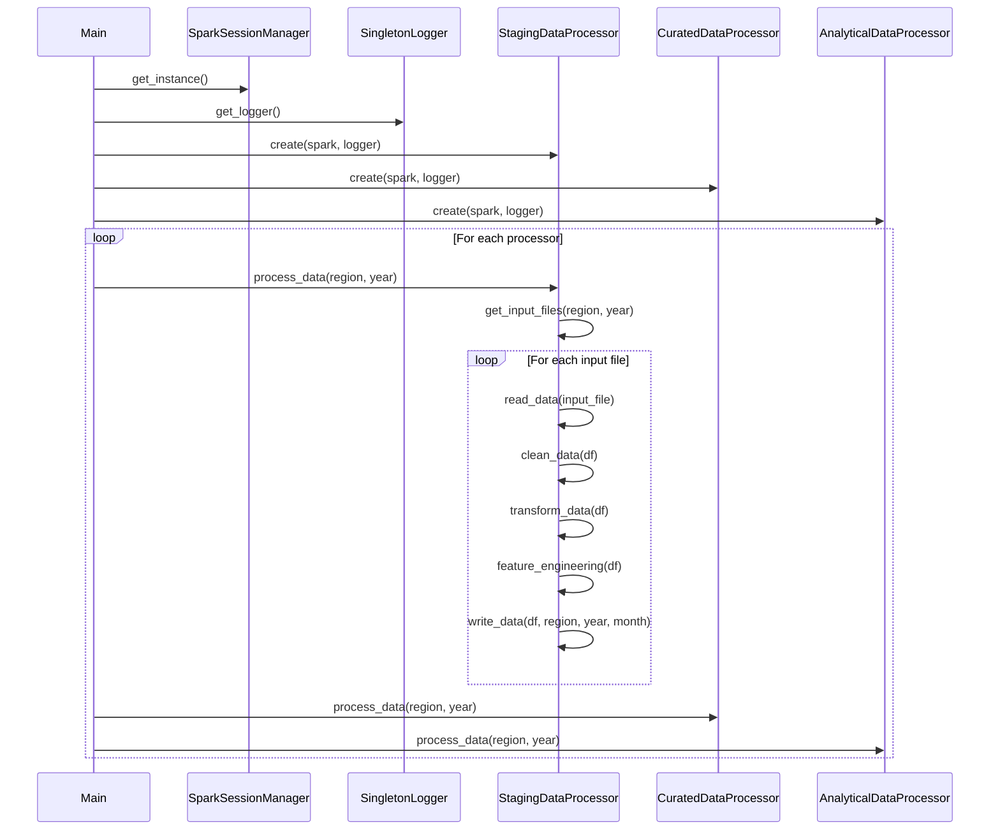
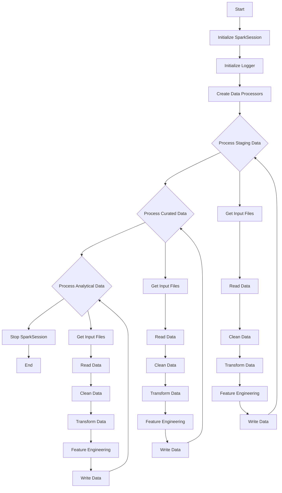

# Energy Price and Demand Forecast

AEMO Aggregated price and demand data

# Data Processing Project

This project implements a data processing pipeline for staging, curated, and analytical layers using PySpark. It includes a thread-safe singleton logger, a SparkSession manager, and abstract and concrete data processor classes.

## Project Structure

The project consists of the following main components:

1. `SingletonLogger`: A thread-safe singleton class for logging.
2. `SparkSessionManager`: A singleton class for managing the SparkSession.
3. `DataProcessor`: An abstract base class for data processors.
4. `StagingDataProcessor`, `CuratedDataProcessor`, `AnalyticalDataProcessor`: Concrete implementations of the `DataProcessor` class for different data layers.
5. `main()` function: Orchestrates the data processing pipeline.

## Class Diagram

## Sequence Diagram

## Flowchart

## Usage

To run the data processing pipeline, execute the `main()` function in the main module. This will process data for all specified regions and years through the staging, curated, and analytical layers.

The `SingletonLogger` and `SparkSessionManager` classes ensure that only one instance of the logger and SparkSession are created and used throughout the application, promoting consistency and resource efficiency.

Each data processor (`StagingDataProcessor`, `CuratedDataProcessor`, and `AnalyticalDataProcessor`) implements the abstract `DataProcessor` class, providing specific implementations for reading, cleaning, transforming, and writing data for their respective layers.

The main function orchestrates the entire process, creating instances of each processor and running them for each specified region and year.

