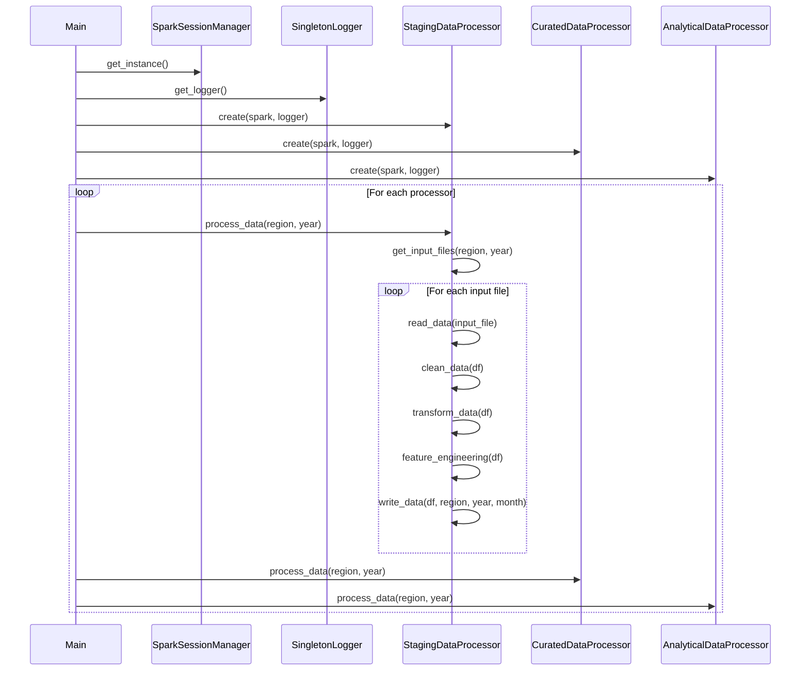

[](https://codecov.io/gh/arturogonzalezm/energy_price_and_demand_forecast)
[](https://github.com/arturogonzalezm/energy_price_and_demand_forecast/actions/workflows/workflow.yml)
[](https://opensource.org/licenses/MIT)

# AEMO Aggregated Price and Demand Data

## Overview

The Australian Energy Market Operator (AEMO) is responsible for operating Australia's largest gas and electricity markets and power systems. 
One of the key datasets they provide is the Aggregated Price and Demand Data, which is crucial for understanding the dynamics of the National Electricity Market (NEM).

The Australian Energy Market Operator (AEMO) plays a crucial role in Australia's energy landscape, particularly in operating the National Electricity Market (NEM) 
as a wholesale market. Understanding AEMO's purpose in this context is essential for grasping the significance of the price and demand data we're processing in our project.

## Key Components

1. **Regional Reference Price (RRP)**
   - This is the wholesale electricity price for each region in the NEM.
   - It's calculated every 5 minutes and then averaged over 30-minute intervals.
   - The RRP is used for settlement purposes in the spot market.

2. **Total Demand**
   - Represents the total electricity consumption in a region.
   - Includes both native demand (local consumption) and interstate exports.
   - Measured in megawatts (MW).

3. **Region**
   - The NEM is divided into five regions, generally aligning with state boundaries:
     - New South Wales (NSW)
     - Victoria (VIC)
     - Queensland (QLD)
     - South Australia (SA)
     - Tasmania (TAS)

4. **Settlement Date**
   - The date and time for which the data is recorded.
   - Typically provided in 30-minute intervals.

5. **Period Type**
   - Indicates whether the data corresponds to a TRADE interval or a NON-TRADE interval.
   - TRADE intervals are normal trading periods.
   - NON-TRADE intervals might occur during system restarts or other exceptional circumstances.

## Key Functions of AEMO in the Wholesale Market

1. **Market Operation**
   - AEMO operates the NEM, which is one of the world's longest interconnected power systems.
   - It manages the spot market where generators sell electricity and retailers buy it to on-sell to consumers.
   - The market operates 24/7, with prices set every 5 minutes.

2. **Supply-Demand Balance**
   - AEMO ensures that electricity supply meets demand in real-time.
   - It forecasts electricity demand and schedules generation to meet this demand.
   - When demand changes unexpectedly, AEMO can call on additional generation or demand response to maintain system balance.

3. **Price Setting**
   - AEMO doesn't set prices directly but facilitates the process where prices are determined by supply and demand.
   - It calculates and publishes the spot price every 5 minutes based on the highest-priced generation bid needed to meet demand.

4. **Settlement**
   - AEMO manages the financial settlement process for the wholesale market.
   - It calculates how much generators should be paid and how much retailers should pay based on the spot price and the amount of electricity produced or consumed.

5. **Information Provision**
   - AEMO collects, analyses, and publishes a wide range of data (including the price and demand data we're processing).
   - This information is crucial for market participants to make informed decisions about generation, investment, and trading strategies.

6. **System Security**
   - While not directly related to its wholesale market function, AEMO is also responsible for maintaining the security and reliability of the power system.
   - This includes managing frequency, voltage, and other technical aspects of the grid.

## Importance of the Wholesale Market

1. **Efficiency**: The wholesale market aims to deliver electricity at the lowest possible cost by dispatching the most efficient generators first.

2. **Price Signals**: Wholesale prices provide important signals to the market about where and when new investment in generation or transmission infrastructure is needed.

3. **Risk Management**: The market allows participants to manage price risks through financial hedging instruments.

4. **Facilitating Competition**: The wholesale market structure encourages competition among generators and retailers, which can lead to better outcomes for consumers.

5. **Enabling Renewables Integration**: The market structure allows for the integration of variable renewable energy sources, balancing their output with more dispatchable sources.

## Relevance to this AEMO Aggregated Price and Demand DataProject

1. **Price Data**: The Regional Reference Price (RRP) in our data is the wholesale spot price determined through AEMO's market operations.

2. **Demand Data**: The Total Demand figures reflect the real-time balance of supply and demand that AEMO manages.

3. **Regional Structure**: The regional division in our data aligns with how AEMO operates the NEM across different states.

4. **Time Intervals**: The 5-minute and 30-minute data intervals in our project correspond to AEMO's pricing and settlement periods.

5. **Data Uses**: The insights derived from our data processing can be used by market participants for the same purposes that AEMO provides this data: to inform bidding strategies, investment decisions, and policy making.

Understanding AEMO's role as a wholesale market operator provides crucial context for interpreting and analysing the price and demand data in our project. It helps explain why this data is structured the way it is, and why it's so valuable for various stakeholders in the Australian energy sector.

## Data Structure

Based on the schema defined in the `StagingDataProcessor`, the AEMO data likely has the following structure:

```python
schema = StructType([
    StructField("REGION", StringType(), True),
    StructField("SETTLEMENTDATE", StringType(), True),
    StructField("TOTALDEMAND", DoubleType(), True),
    StructField("RRP", DoubleType(), True),
    StructField("PERIODTYPE", StringType(), True),
])
```

## Importance and Uses

1. **Market Analysis**: This data is crucial for understanding market dynamics, including how prices respond to changes in demand.

2. **Forecasting**: Historical price and demand data are essential inputs for forecasting future electricity prices and demand.

3. **Investment Decisions**: Energy companies and investors use this data to inform decisions about new generation capacity or grid infrastructure.

4. **Policy Making**: Policymakers analyse this data to understand market trends and the effects of various policies on electricity prices and demand.

5. **Research**: Academics and analysts use this data to study various aspects of the electricity market, including efficiency, competitiveness, and the impact of renewable energy integration.

6. **Consumer Insights**: Large consumers can use this data to optimise their electricity usage and potentially reduce costs.

## Data Processing Pipeline

In the context of the data processing project we've been discussing:

1. **Staging Layer** (`StagingDataProcessor`): 
   - Reads the raw CSV files from AEMO.
   - Performs initial cleaning and validation.
   - Converts settlement dates to a standardised timestamp format.

2. **Curated Layer** (`CuratedDataProcessor`):
   - Aggregates the data, possibly to daily or hourly intervals.
   - Calculates additional metrics like average demand and average RRP.

3. **Analytical Layer** (`AnalyticalDataProcessor`):
   - Performs more complex aggregations and calculations.
   - Might include features like demand-price ratios or monthly summaries.

This multi-layer approach allows for increasingly refined and valuable insights to be drawn from the raw AEMO data.

## Sequence Diagram



# Specs

- Python 3.12
- PySpark 3.5.1
- Tested on Linux and MacOS
- PyTest (TDD)
- Codecov (Code Coverage)


# Data Processing Project

This project implements a data processing pipeline for staging, curated, and analytical layers using PySpark. It includes a thread-safe singleton logger, a SparkSession manager, and abstract and concrete data processor classes.

## Project Structure

The project consists of the following main components:

1. `SingletonLogger`: A thread-safe singleton class for logging.
2. `SparkSessionManager`: A singleton class for managing the SparkSession.
3. `DataProcessor`: An abstract base class for data processors.
4. `StagingDataProcessor`, `CuratedDataProcessor`, `AnalyticalDataProcessor`: Concrete implementations of the `DataProcessor` class for different data layers.
5. `main()` function: Orchestrates the data processing pipeline.

## Class Diagram


## Flowchart


## Usage

To run the data processing pipeline, execute the `main()` function in the main module. This will process data for all specified regions and years through the staging, curated, and analytical layers.

The `SingletonLogger` and `SparkSessionManager` classes ensure that only one instance of the logger and SparkSession are created and used throughout the application, promoting consistency and resource efficiency.

Each data processor (`StagingDataProcessor`, `CuratedDataProcessor`, and `AnalyticalDataProcessor`) implements the abstract `DataProcessor` class, providing specific implementations for reading, cleaning, transforming, and writing data for their respective layers.

The main function orchestrates the entire process, creating instances of each processor and running them for each specified region and year.

# Testing

```bash
python main.py
```

# Design Patterns in the Energy Price and Demand Forecast Data Project

This project implements several design patterns to promote code reusability, flexibility, and maintainability. Let's examine each of these patterns:

## 1. Singleton Pattern

The Singleton pattern is used twice in this project:

### a. SingletonLogger

```python
class SingletonLogger:
    _instance = None
    _lock = threading.RLock()

    def __new__(cls, logger_name=None, log_level=logging.DEBUG, log_format=None):
        if not cls._instance:
            with cls._lock:
                if not cls._instance:
                    cls._instance = super().__new__(cls)
                    cls._instance._initialize_logger(logger_name, log_level, log_format)
        else:
            cls._instance._update_logger(log_level, log_format)
        return cls._instance
```

This implementation ensures that only one instance of the logger is created and used throughout the application. It uses double-checked locking for thread safety.

### b. SparkSessionManager

```python
class SparkSessionManager:
    _instance = None

    @classmethod
    def get_instance(cls):
        if cls._instance is None:
            cls._instance = SparkSession.builder.appName("DefaultApp").getOrCreate()
        return cls._instance
```

This class ensures that only one SparkSession is created and reused across the application.

The Singleton pattern is used here to:
- Ensure consistent logging across the application
- Manage resources efficiently by reusing the SparkSession

## 2. Template Method Pattern

The Template Method pattern is implemented in the `DataProcessor` abstract base class:

```python
class DataProcessor(ABC):
    def process_data(self, region, year):
        try:
            input_files = self.get_input_files(region, year)
            for input_file in input_files:
                df = self.read_data(input_file)
                df_cleaned = self.clean_data(df)
                df_transformed = self.transform_data(df_cleaned)
                df_features = self.feature_engineering(df_transformed)
                month = self.extract_month(input_file)
                self.write_data(df_features, region, year, month)
        except Exception as e:
            self.logger.error("Error in process_data for %s in %s: %s", region, year, str(e))
```

The `process_data` method defines the skeleton of the algorithm, with abstract methods that are implemented by subclasses:

```python
@abstractmethod
def get_input_files(self, region, year):
    pass

@abstractmethod
def read_data(self, input_file):
    pass

# ... other abstract methods
```

This pattern allows the subclasses (`StagingDataProcessor`, `CuratedDataProcessor`, and `AnalyticalDataProcessor`) to provide specific implementations for each step of the data processing while keeping the overall algorithm structure consistent.

## 3. Factory Method Pattern

While not explicitly implemented as a separate factory class, the `DataProcessor` abstract base class acts as a creator in the Factory Method pattern. Each concrete subclass (`StagingDataProcessor`, `CuratedDataProcessor`, `AnalyticalDataProcessor`) creates specific data processing objects:

```python
class StagingDataProcessor(DataProcessor):
    def read_data(self, input_file):
        schema = StructType([
            StructField("REGION", StringType(), True),
            StructField("SETTLEMENTDATE", StringType(), True),
            StructField("TOTALDEMAND", DoubleType(), True),
            StructField("RRP", DoubleType(), True),
            StructField("PERIODTYPE", StringType(), True),
        ])
        return self.spark.read.csv(input_file, header=True, schema=schema)

class CuratedDataProcessor(DataProcessor):
    def read_data(self, input_file):
        return self.spark.read.parquet(input_file)

class AnalyticalDataProcessor(DataProcessor):
    def read_data(self, input_file):
        return self.spark.read.parquet(input_file)
```

Each subclass "factory" creates data frames with specific schemas and from different data sources.

## 4. Strategy Pattern

The Strategy pattern is implicitly used in the way different data processors are employed in the main function:

```python
processors = [
    StagingDataProcessor(spark, logger),
    CuratedDataProcessor(spark, logger),
    AnalyticalDataProcessor(spark, logger)
]

for processor in processors:
    logger.info("Starting %s", processor.__class__.__name__)
    for region in regions:
        logger.info("Processing region: %s", region)
        processor.process_data(region, year)
```

Here, each processor represents a different strategy for data processing. The main function can work with any processor that follows the `DataProcessor` interface, allowing for flexible and interchangeable data processing strategies.

## Benefits of These Patterns

1. **Singleton**: Ensures consistent logging and efficient resource management.
2. **Template Method**: Provides a consistent structure for data processing while allowing for customization in specific steps.
3. **Factory Method**: Allows for creation of specific data processing objects without tightly coupling the main code to specific classes.
4. **Strategy**: Enables easy swapping of data processing algorithms and addition of new processors without changing the main code.

These patterns work together to create a flexible, maintainable, and extensible data processing system.


